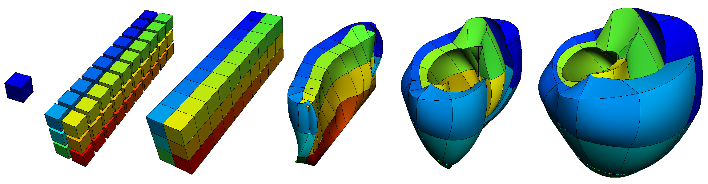
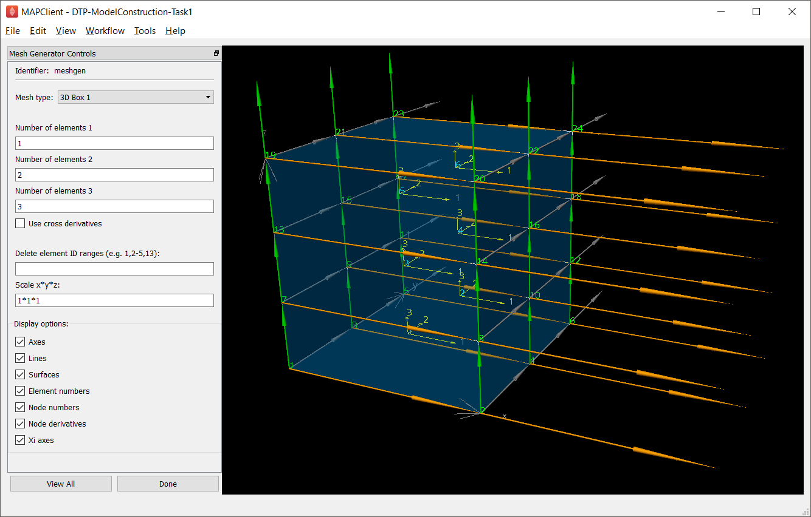
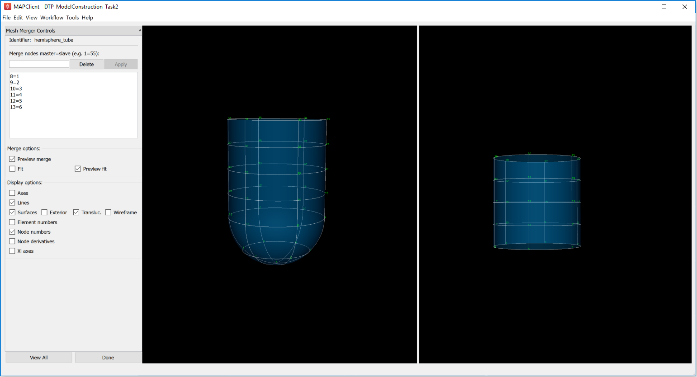
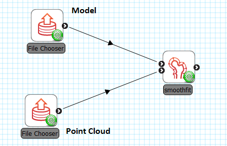
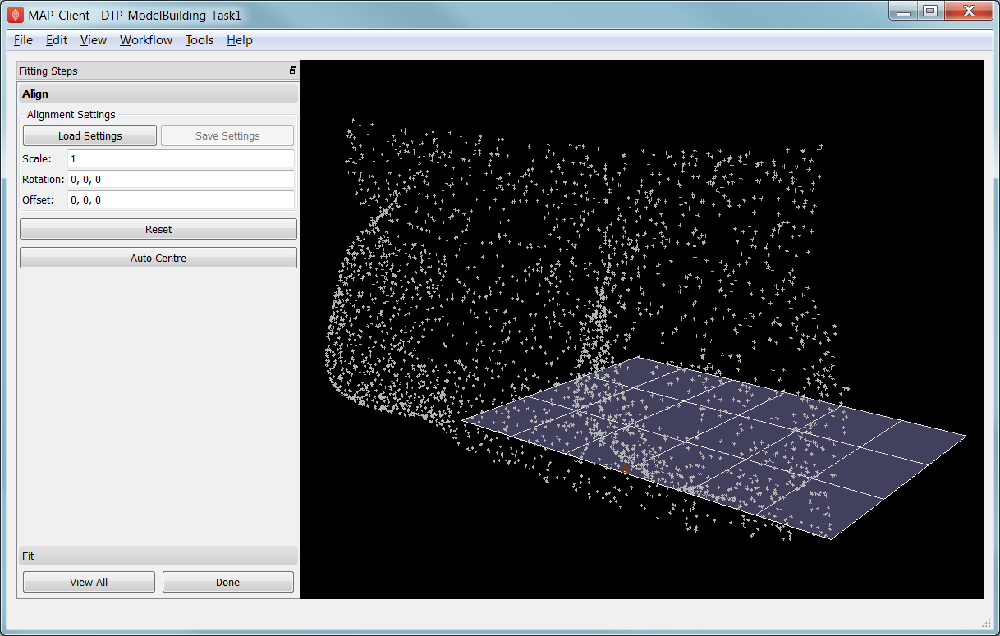
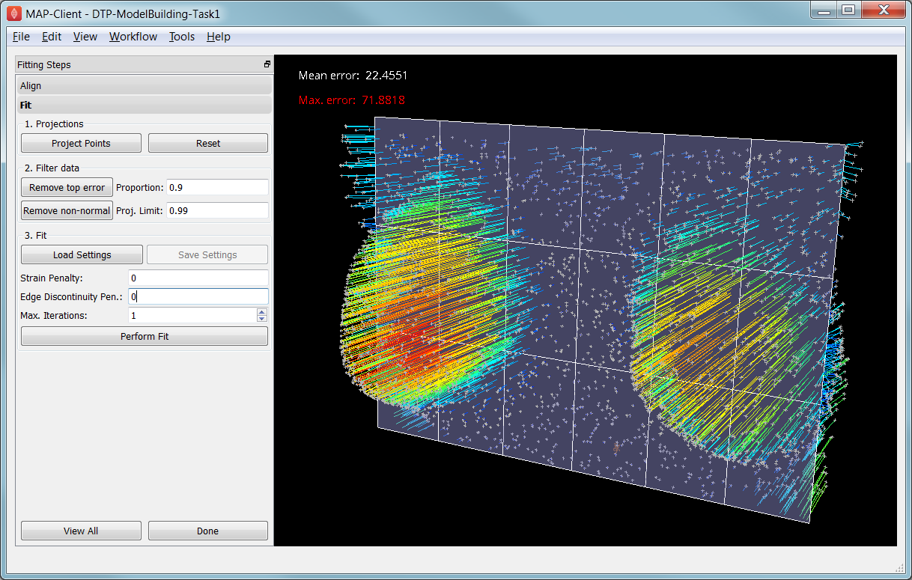
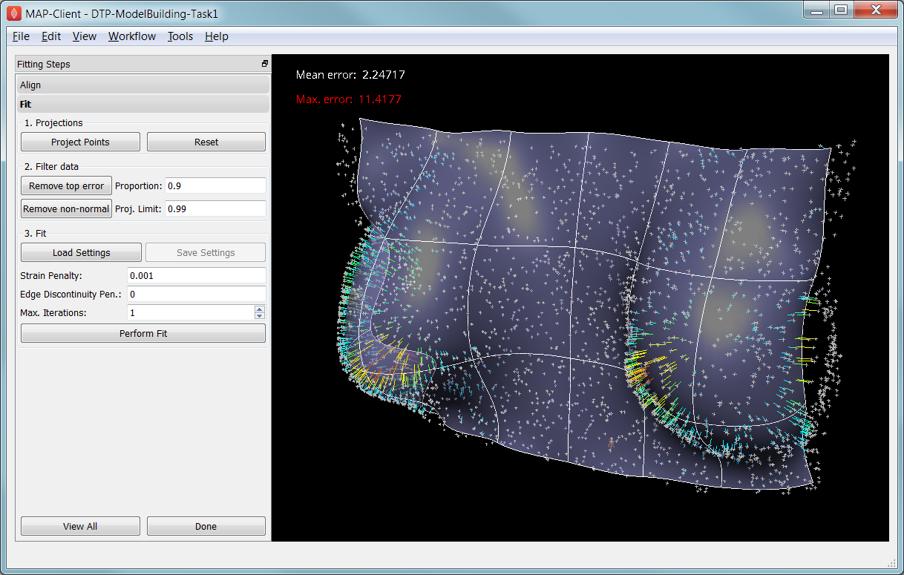

==================
Model Construction
==================

Model construction consists of:

#. *Mesh Creation*: creating a finite element mesh with a topology and interpolation suited to describing the body of interest to the level of detail required.
#. *Geometric Fitting*: customising the geometry of the mesh to be physically realistic, or tailored to an individual.
#. *Material Field Definition*: describing and fitting additional spatially-varying fields which affect behaviour of the body e.g. material properties such as fibre orientations for anisotropic materials. 

The central part of this tutorial fits models to breast surface data. This is a very practical application, since customising breast models to individuals is needed to simulate deformation with change in pose, and this in turn helps co-locate regions of possible cancerous tissue from multiple medical images each made with different imaging devices which necessarily use different body poses.

Mesh Creation
=============

We are concerned with constructing models consisting of 'finite elements' -- simple shapes such as triangles, squares, cubes etc. -- which join together to form a 'mesh' which covers the body and describes its topology. Over the elements of the mesh we interpolate coordinates (and eventually other fields of interest) to give the model its 3-D shape and location. Usually mesh creation involves creating the elements and specifying at least initial coordinates for the model.

Common methods for creating a finite element mesh include:

#. Automatic mesh generation to boundaries described by segmented edges, point clouds or CAD models. Automated algorithms are usually limited to creating triangle (in 2-D) or tetrahedron (3-D) elements.
#. Generating part or all the topology from simple, standard shapes such as plates, blocks and tubes, connecting them together then fitting to geometric data. The examples below use this approach.
#. Manually building elements by selecting/creating corner points ('nodes') in the correct order. To ease creating a valid model, tools can assist by locking on to points from a surface or point cloud segmented from real medical images.

From a simpler mesh, more complicated models can be created. Surface models can be automatically extruded to 3-D models (triangles become wedges, squares become cubes). Also, different, higher-order basis functions can be used over the same topology to give more degrees of freedom in the model. This is particularly important for studying the human body as it contains few straight lines. In many models of body parts we employ C\ :sub:`1`\ -continuous cubic Hermite basis (interpolation) functions to model their inherent smoothness, and the following examples demonstrate this. There is a downside to using Hermite bases: very careful adjustments are needed to properly connect the mesh in areas where the topology is non-trivial, such as where rounded bodies are closed (top of head, apex of heart), bifurcations (between fingers, legs), and where mesh density needs to be increased.

Mesh creation is a very involved topic; one needs to consider favourable alignment of elements with expected material behaviour, having sufficient density of elements to describe the problem with desired accuracy (the fitting examples below employ 2 different sized meshes to give some indication of the importance of mesh refinement). In contrast, one also wishes to minimise the model size (measured by total number of degrees of freedom) to reduce computation time.

Interactive Graphics Controls
-----------------------------

The following tasks use interactive 3-D graphics. In any of the graphical workflow steps you may rotate, pan and zoom the view using the standard controls in the following table, click *View All* to recentre the view and click *Done* to complete/close the workflow step (and save the output model for subsequent workflow steps):

======================= ==============
Mouse Button            Transformation
======================= ==============
Left                    Tumble/Rotate
----------------------- --------------
Middle or Shift+Left    Pan/Translate
----------------------- --------------
Right or Ctrl+Left(Mac) Fly Zoom
----------------------- --------------
Shift+Right             Camera Zoom
======================= ==============

Task 0: Visualising Model Construction
--------------------------------------

We will jump ahead to look at an example from the visualisation course as it's very illustrative of the process of building a model out of simple shapes. Open the *DTP-Visualisation-Task1* workflow and execute it. :numref:`fig_dtp_cp_modcon_heart_mesh_construction` shows a time sequence of constructing a heart model from this example which you will be able to view interactively.

.. _fig_dtp_cp_modcon_heart_mesh_construction:

   Heart mesh construction stages: a single template element; multiple disconnected elements; elements merged into a connected mesh; mesh geometry gradually warped into the shape of the heart, closing up the sides and apex.

This example opens up a SimpleViz viewer for a model that shows stages in constructing a heart model. At the left of the window is a toolbox; switch to the 'time' page of the tool box and drag the time slider between 0 and 1. Rotate, pan and zoom into the view using the mouse controls described above.

In most of the model the initially cube-shaped elements are stretched, compressed or distorted, but they keep their essential cube or hexahedral *topology*. However, at the apex (bottom of the heart) the cubes are collapsed into wedge shapes, which while being permissible is an approach which should be minimised.

Task 1: Procedural Mesh Generation
----------------------------------

Open the *DTP-ModelBuilding-Task1* workflow and execute it. You will see the *Mesh Generator* interface as shown in :numref:`fig_dtp_cp_modcon_mesh_generator`:

.. _fig_dtp_cp_modcon_mesh_generator:

   Mesh generator interface 

In this task you are encouraged to play: try all mesh types, vary the numbers of elements and options as applicable to the mesh type, turn on and off all graphics, delete elements and scale the mesh.

The mesh types include basic shapes such as 2-D plate, tube and sphere, 3-D box, tube and sphere shell. Other more complicated meshes are being added including whole organ mesh generators. Typical for most finite elements, parameters (for the coordinates field) are held at corner points called 'nodes', and these are interpolated across the elements.

Special to the elements in these generated mesh are node derivative parameters which are interpolated with *Hermite* basis functions to give smooth geometries. If you display *Node derivatives* you will see 2 or 3 arrows showing these derivative parameters which represent tangent vectors at the nodes. The *Xi axes* show the orientation of the coordinate system of each element. Hermite interpolation is simplest when the Xi axes and node derivatives are in-line, and consistent between neighbouring elements; it's best to make this the case over most of a mesh.

The elements around the apexes of the sphere meshes use *general linear maps* to sum the apex derivatives weighted by cos and sin terms to smoothly close the mesh at these points. This is generally needed wherever neighbouring elements' coordinates are not aligned.

Ranges of elements can be deleted from the generated mesh, but this is best done after choosing the numbers of elements options for each mesh type. Note that parts of spheres can be deleted to make e.g. bottom or top hemispheres.

All the current mesh types make a unit sized mesh by default, but the scale option allows this to be scaled differently in x, y and z.

Task 2: Mesh Generation and Merging
-----------------------------------

Open the *DTP-ModelBuilding-Task2* workflow and execute it. Observe the mesh generation steps which make a hemisphere and a tube, then proceed to the Mesh Merger step:

.. _fig_dtp_cp_modcon_mesh_merger:

   Mesh merger interface, after merging master-slave nodes

The first/top input to the Mesh Merger workflow step is the *master* mesh, which appears on the left of the interface, while the second/bottom input is the *slave* mesh, shown on the right. Merging is performed by matching (equating) node numbers from the master mesh with the ones in the slave. The master mesh is so named because it is unmodified by the merge: matched nodes on the slave are replaced by the equivalent master nodes, and the remaining slave nodes are transformed to fit the master, and they with the slave elements are added to the master mesh in the left panel, which is output by the workflow step.

This tool has recently been enhanced to allow master and slave nodes to be interactively selected in the 3-D view, by holding down the 'S' key and clicking on node numbers or node derivatives - one of these must be visible. The slave mesh is now automatically aligned with the master mesh, and there is the option to perform a fit to smooth it out to reduce distortion where the two meshes joined (but beware: it can be slow). Another new feature is that the list of master=slave pairings can be edited, however the changes don't take effect until the 'Apply' button is pressed.

Feel free to change the matching nodes (which can be deleted by entering the number and pressing the 'Delete' push button, or edited by equating with a different slave node number). No harm is done if nonsense is entered!

Geometric Fitting
=================

The remainder of this tutorial concentrates on directly fitting simple models to data point clouds obtained from an earlier segmentation or other digitisation step. Other types of fitting not covered include:

* Fitting to modes from a Principal Component Analysis, where the variation in geometry over a population is reduced to linear combinations of a small number of significant mode shapes (key model poses), and lesser modes are discarded;
* Host-mesh fitting where the body is embedded in a coarse, smooth *host* mesh, data is used to morph the host mesh and the embedded *slave* mesh is moved with it.

In many cases the above methods are used as a first step to get a close approximation before direct geometric fitting.

Smoothfit Tool
--------------

This tutorial uses the *Smoothfit* MAP client plugin for interactive fitting. The inputs to Smoothfit in a workflow are a model file and a point cloud file (each currently limited to EX or FieldML formats that can be read by OpenCMISS-Zinc). The workflow in the MAP client is shown in :numref:`fig_dtp_cp_modcon_fitting_workflow`, and requires only the input files to be specified (and workflow step identifiers to be named):

.. _fig_dtp_cp_modcon_fitting_workflow:

   Geometric fitting workflow in the MAP client framework.

When the workflow is executed, the smoothfit interface is displayed showing the model as a semi-transparent surface and the point cloud as a cloud of small crosses. The initial view in :numref:`fig_dtp_cp_modcon_fitting_align` shows the interface in its pre-fitting *Align* state.

.. _fig_dtp_cp_modcon_fitting_align:

   Interface for aligning the model with the data point cloud.

Smoothfit uses the interactive view controls defined earlier, including *View All* to recentre the view and click *Done* to close the workflow step and save the output model for subsequent workflow steps.

In the Smoothfit user interface you can hover the mouse pointer over most controls to get help -- tool tips -- which explain what they do. 

**Pre-fit: model alignment**

The first step in fitting is to scale the model and bring it into alignment with the data point cloud prior to projecting data points and fitting. The need to align the model well is explained later with the projection step. To perform alignment you must be on the Align page in the tool bar, switched to by clicking on the *Align* label.

To align and scale the model, hold down the 'A' key as you left, middle and right mouse button drag in the window (or variant as in the above table): this moves the model relative to the data cloud. Be aware that rotation is a little difficult and may take practice. Other controls include alignment reset, auto centre (in case the model is very far from the data points; may need to click *View All* afterwards) and the Load button which will load a saved alignment. (Note that the Save button is disabled in the smoothfit configuration for these tutorials so a pre-saved good alignment is always available for loading.)

Often the shape of the model and point cloud make it pretty clear where to align to. Smoothfit uses manual alignment, but other tools may make it automatic (based on shape analysis) or semi-automatic (e.g. by identifying 3 or more points on the data cloud as being key points on the model, and automatically transforming to align with them).

**Fit stage 1: projecting points**

Once the model and data points are aligned, switch to the fitting page in the tool bar by clicking on the *Fit* label. These controls show that fitting has three stages: projecting points onto the mesh, filtering bad data, and performing the fit with some user parameters.

Fitting is usually a non-linear task: after initial fits, possibly with multiple iterations, you may need to go back and re-project data points, filter data and re-fit, possibly with different parameters. The trial-and-error nature of fitting, together with the need for judgement on whether a good fit is achieved,  make it less a science and more of a dark art!

The first step in fitting is to project the data points onto the nearest locations on the elements of the aligned model, by clicking on the *Project Points* button. In the window you will see projection lines from the data points to the nearest point on the model as shown in :numref:`fig_dtp_cp_modcon_fitting_project`. These projection lines, interpreted as fitting errors, are coloured by length (blue closest, red furthest away), and there is an on-screen display of the current mean and maximum projection error.

.. _fig_dtp_cp_modcon_fitting_project:

   Data points projected onto the initial model.

The key point is that the projections are what the fitting aims to minimise, and if they don't agree on where a point on the mesh should move to, the fit will have problems. It's good if the projection lines are short and/or near parallel, and it's bad if they cross over each other. Two things that help produce good projections are:

1. Good initial alignment of the model. Surfaces should ideally be close to the data points, or at least in a position to produce near-parallel projections.
2. The model should be smoothly curved, i.e. without excessive surface waviness. To help this we use fitting parameters which produce smoother results for initial gross fitting, which we intend to re-project onto for subsequent fine fitting.

In the worst cases, projecting distant data points onto a very wavy model, will produce data which is unusable for fitting.

Note that clicking on the *Reset* button clears all current projections, and restores all points that have been filtered out for subsequent projection.

**Fit stage 2: filtering data**

We often find that some of the data points are not providing useful data for the fit, and we will want to filter these out. The *Filter data* controls shown in  :numref:`fig_dtp_cp_modcon_fitting_project` allow us to remove data points according to two algorithms.

The first simply removes the data points whose projections are in the specified top proportion of the maximum error, 0.9 (90%) by default. This is mainly used where the data cloud is *noisy* or contains some rogue data points which are best taken out of the solution.

The second filtering tool removes data points whose projections are not normal to the surface. This is only suitable for use with smooth C\ :sub:`1`\ -continuous coordinates (e.g. the Hermite basis meshes used for most of this tutorial) where the surface normal does not suddenly change on element boundaries in the mesh. **Note:** *It is important that you use this only after re-projecting data points since after performing the fit the data point projections will no longer be normal to the surface!* 

When fitting a surface model to only a subset of the data points, you will need to use the non-normal filter (and sometimes the top error filter) to eliminate the data points clearly outside of the surface to be fit.

Filtering the data points removes those points from the active set of data points, which gets smaller each time but may be reset to all data points using the *Reset* button.

**Fit stage 3: performing the fit**

With data points projected, and bad data filtered out you are ready to fit by clicking on the *Perform Fit* button, however we will usually need to play around with parameters controlling the fit to achieve a good result. :numref:`fig_dtp_cp_modcon_fitting_fit` shows what the view looks like after 2 iterations of fitting with a moderate strain penalty to keep the solution smooth.

.. _fig_dtp_cp_modcon_fitting_fit:

   Display after gross fitting the breast model.

Fitting may be non-linear so multiple iterations may be needed to converge on a solution. Through the interface one can either re-click on *Perform Fit* or increase the maximum number of iterations before fitting; note fitting stops either when the solution has converged or the maximum iterations is reached. If the intention is to re-project points later, it is purely up to the user how many iterations to perform before doing this; for typical problems where one wishes to *gross fit* first, it's best to ensure enough iterations have been performed to get the solution close enough for re-projection.

Beware that projections are not recalculated during the fitting: you must manually click on *Project Points* to do this, and you will probably want to filter some more points before re-fitting.

Switching back to the *Align* page clears the fitted solution altogether.

The penalty values allow you to smooth the fit by penalising particular deformations. The strain penalty limits excessive strain in the model so where there is absent or noisy data, solutions which minimise the deformation from the initial aligned state are favoured. The edge discontinuity penalty is only useful for non-C\ :sub:`1`\ -continuous coordinate fields such as the final linear mesh example. Penalties always increase the data point projection error (in a least squares sense, which is the solution method used in the fitting), but generally give a much more attractive result. Penalty values should be adjusted in orders of magnitude until a likeable result is obtained, then fine-tuned. It is often better to use stiffer (higher penalty) values for initial iterations (gross fitting) to prevent waviness from developing in the mesh, then re-projecting and reducing penalties for a final iteration (fine fitting). As for the alignment settings, you can load and save (if enabled) the fitting options.

Note that Smoothfit does not yet offer a curvature penalty which is one of the most powerful tools for dealing with noisy or sparse data. Using the strain penalty is the next best thing but isn't as good at dealing with excessive waviness in the solution, particularly since higher values capable of helping the waviness may considerably reduce the accuracy of the fit. This shortcoming will hopefully be rectified in a later version.

Performing the fit can take a few seconds, and Smoothfit will appear to hang when fitting is in progress. Processing time is longer with more elements, more complex elements, more data points and when applying penalty terms.

The following tutorial tasks each have a workflow associated with them which should be run in the usual way.

Task 3: Coarse plate model fitted to breast data
------------------------------------------------

Open the *DTP-ModelBuilding-Task3* workflow and execute it. The breast data was obtained in 'prone' pose (hanging down) as done in MRI scans; this is also the simplest pose to digitise and fit to. Try manually aligning the surface with the breast data using the mouse controls described earlier (hold down 'A' key and the left, middle or right mouse button and drag to rotate, pan or scale the model). Project points and attempt to fit without any smoothing parameters. It takes several seconds to perform the fit: be patient! Try multiple fit iterations until the solution is stable. Re-project and try again.

The result without smoothing even for this example with a coarse mesh and a relatively large number of high quality data points is quite wavy, particularly around the edges. It also has some unusual depressions about the front of the breasts which is not really representative of the data cloud in general.

For a second exercise we'll use a set sequence to obtain a good fit:

1. Switch to the Align page to reset the fit, click on 'Load' to load a good alignment. 

2. Switch to the Fit page, project points and click on 'Remove non-normal'.

3. Click 'Load' to load a moderate strain penalty of 0.001 and perform the fit 2 times to get fairly close to the data points.

4. Re-project the data points and click on 'Remove non-normal'. (This is the state shown in :numref:`fig_dtp_cp_modcon_fitting_fit`.)

5. Lower the strain penalty to 0.0001 and fit once more. The error bars almost disappear over most of both breasts.

6. Write down the mean and maximum error for comparison later.

While the fit appears to be reasonable over most of the breast area, zoom in close on the tips of the breasts and you will see that the fit is not quite so good there. This is due to the mesh having too few elements to fit the data. The next task uses a slightly denser mesh which can achieve a closer fit, however you will need to wait longer for it to solve.

As an extra exercise switch to the Align page to reset the fit, re-project points and fit with a much higher strain penalty (e.g. 0.01) to see how it limits the possible deformation (after several iterations): this is what is considered a 'stiff' model.

Also try fitting with very poor initial alignment to see what happens.

Task 4: Fine plate model fitted to breast data
----------------------------------------------

Open the *DTP-ModelBuilding-Task4* workflow and execute it. It has the same data point cloud as the first task, but has a mesh with more than twice as many elements and approximately twice as many parameters, so it is more able to attain a close fit with the data, but takes longer to solve.

Try some of the exercises from Task 1 with this model. With more elements the model is more susceptible to wavy solutions so applying appropriate smoothing penalties is more critical. 

When performing the second exercise from Task 1, iterate 3 times with the initial strain penalty of 0.001, then re-project points and fit with a strain penalty of 0.0001. Note down the mean and and error: the mean should be under half of the value from Task 1. More importantly, zoom in on the tips of the breasts to see that the fit is much better there.

Task 5: Fine plate model fitted to noisy data
---------------------------------------------

Open the *DTP-ModelBuilding-Task5* workflow and execute it. This example uses the same fine plate model (make sure it has 8x5 elements with cross derivatives ticked), however random offsets up to +/- 5mm have been added to all data points. With a large enough number of data points the effect of randomness is diminished however in small areas the randomness can introduce waviness to the solution, so smoothing penalties must be applied.

Try fitting the model without any strain penalty, and fit with several iterations to see the waviness. Reset the fit and try with the regime from task 1: 2 iters at strain penalty 0.001, re-project, 1 iter at strain penalty 0.0001. The overall result is a good fit but there is unattractive waviness on the chest area. If a curvature penalty were available, these issues with noisy data could be better controlled. You may try turning off cross derivatives in the mesh generator; this should slightly help with waviness, and will make solution faster since it reduces the number of degrees of freedom in the problem.

Because of the random noise the mean error will never get very low, but the average fit of the breast surface can be a reasonable 'best fit'.

Task 6: Bilinear model fitted to point cloud
--------------------------------------------

Open the *DTP-ModelBuilding-Task6* workflow and execute it. This example has a bilinear mesh and needs no alignment with the data point cloud.

Project points and fit with all smoothing penalties set to zero. Rotate the result to see that it has developed a 'ridge' along one side, and the under-constrained corner elements distort unacceptably. Reset the fit (switch to Align and back to Fit pages), reproject and fit with the 'edge discontinuity penalty' set to 1. The result is much smoother. This penalty discourages solutions with differences in surface normals across edges of the mesh. Since the mesh uses bilinear interpolation, exact satisfaction of this condition cannot be met, nevertheless it minimises it as much as possible, and in particular it evens out this discontinuity since it is minimised in a 'least squares' sense.

Experiment with a much higher edge discontinuity penalty (e.g. 10 or even 100) and lower (e.g. 0.1) to see how the fit is affected. Try combining with strain penalty values.

Material Field Fitting
======================

In addition to geometry, bioengineering models often need to include spatially varying data describing the alignment of tissue microstructures, concentrations of cell types, or other differences in material properties. In heart and skeletal muscle, fibre orientations must be described over the body to orient their anisotropic material properties. Similarly, Langer's lines affect properties of the skin, and collagen orientations within other tissue can affect material behaviour.

Each of these properties can be described by spatially-varying fields which interpolate the property of interest over the same elements the coordinates are defined on.

This topic is not covered further in this example, but the concepts of creating and fitting such fields are similar to geometry: one must define the interpolation of the values over the mesh, and fit the field to data obtained from imaging or other techniques. The difference lies mainly in that the data is not coordinates, but orientations when fitting fibres, known concentrations at points for input to cell models etc.

A similar process is often used to obtain solution fields from results. Often the solution technique produces outputs with high accuracy only at certain points in the model. With the Finite Element Method, for example, stress is of highest accuracy at the Gauss points, and fitting can be used to give a better idea of these solution field values away from Gauss points.
